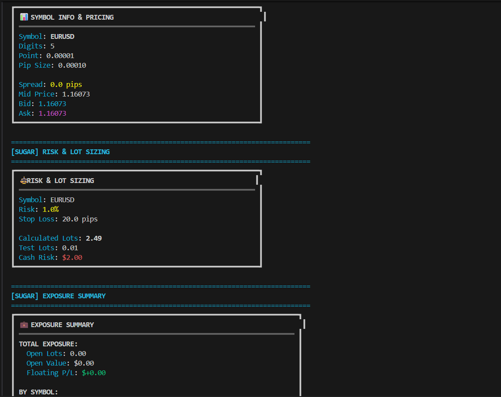

# 🎯 Main Demo Scripts - Overview

Welcome to the **Main** folder! This is your starting point for understanding how to use PyMT4 SDK through practical, runnable examples.

---

## 📚 What's in this folder?

This folder contains **4 demonstration scripts** that showcase different aspects of the PyMT4 SDK:

| Script | Purpose | Complexity | Best For |
|--------|---------|------------|----------|
| [main_low_level.py](#-main_low_levelpy) | Raw MT4 RPC calls | 🔴 Advanced | Full control, learning internals |
| [main_sugar.py](#-main_sugarpy) | High-level Sugar API | 🟢 Beginner | Quick development, readable code |
| [main_streams.py](#-main_streamspy) | Real-time streaming | 🟡 Intermediate | Live data, event-driven apps |
| [main_trade_mod.py](#-main_trade_modpy) | Order modifications | 🟡 Intermediate | Trade management workflows |

---

## 🔧 main_low_level.py

**[→ Full Documentation](main_low_level.md)**

### What it does
Demonstrates **low-level MT4 SDK methods** without any sugar wrappers. This is the raw RPC surface that gives you complete control over every operation.

### Key Features
- Direct access to all MT4 RPC methods
- Quote fetching (`quote`, `quote_many`, `quote_history`)
- Symbol management (`symbols`, `symbol_params_many`)
- Order operations (`order_send`, `order_modify`, `order_close_delete`)
- Streaming APIs (`on_symbol_tick`, `on_trade`, `on_opened_orders_tickets`)
- Account information (`account_summary`)

### When to use
✅ When you need **maximum control** over every parameter
✅ When building **custom trading logic** that doesn't fit sugar abstractions
✅ When **learning the SDK internals** and understanding how things work under the hood
✅ When **optimizing performance** by avoiding wrapper overhead

### Example Output


---

## 🍬 main_sugar.py

**[→ Full Documentation](main_sugar.md)**

### What it does
Showcases **high-level sugar methods** that wrap low-level calls with sane defaults and readable syntax. Perfect for rapid development and quick prototyping.

### Key Features
- Simplified connectivity (`ensure_connected`, `ping`)
- Symbol helpers (`ensure_symbol`, `digits`, `point`, `pip_size`)
- Market calculations (`spread_pips`, `mid_price`, `calc_lot_by_risk`)
- Easy order placement (`buy_market`, `sell_market`, `buy_limit`)
- Quick modifications (`modify_sl_tp_by_pips`, `modify_sl_tp_by_price`)
- Batch operations (`close`, `close_all`)

### When to use
✅ When you want **fast development** with minimal boilerplate
✅ When **readability** is more important than fine-grained control
✅ When building **simple strategies** without complex edge cases
✅ When **onboarding new developers** who need quick wins
✅ When **prototyping ideas** before optimizing

### Example Output


---

## 📡 main_streams.py

**[→ Full Documentation](main_streams.md)**

### What it does
Demonstrates **server-streaming APIs** for real-time subscriptions. Shows how to consume async streams and handle cooperative cancellation.

### Key Features
- Real-time tick streaming (`on_symbol_tick`)
- Trade event monitoring (`on_trade`)
- Order ticket updates (`on_opened_orders_tickets`)
- Profit/loss tracking (`on_opened_orders_profit`)
- Cooperative shutdown with cancellation events
- Back-pressure handling and debouncing

### When to use
✅ When you need **real-time market data** without polling
✅ When building **event-driven applications** that react to changes
✅ When **monitoring positions** and need instant updates
✅ When creating **live dashboards** or charting applications
✅ When **tracking P&L** in real-time

### Example Output


---

## ✏️ main_trade_mod.py

**[→ Full Documentation](main_trade_mod.md)**

### What it does
Focuses on **trade modification flows**: placing, modifying, and closing orders. Shows common sequences like `order_send → order_modify → order_close`.

### Key Features
- Market and pending order placement
- Stop-loss and take-profit modifications
- Partial position closing (`close_partial`)
- Position hedging (`close_by`)
- Order state verification (`opened_orders`)
- Price and lot normalization

### When to use
✅ When building **trade management systems**
✅ When implementing **trailing stops** or dynamic SL/TP
✅ When **scaling in/out** of positions
✅ When **hedging positions** with opposite orders
✅ When **testing order modification** logic

### Example Output


---

## 🚀 Quick Start Guide

### 1. Choose your starting point

**New to PyMT4?** → Start with [main_sugar.py](main_sugar.md)
**Need real-time data?** → Check out [main_streams.py](main_streams.md)
**Building trade logic?** → Look at [main_trade_mod.py](main_trade_mod.md)
**Want full control?** → Explore [main_low_level.py](main_low_level.md)

### 2. Run the script

```bash
# Make sure PyMT4 is installed
pip install PyMT4

# Run any demo script
python main_sugar.py
python main_streams.py
python main_low_level.py
python main_trade_mod.py
```

### 3. Modify and experiment

All scripts are designed to be:
- ✅ **Self-contained** - Run without external dependencies
- ✅ **Well-commented** - Understand what each line does
- ✅ **Easy to modify** - Change symbols, lots, parameters
- ✅ **Production-ready patterns** - Use as templates for your own code

---

## 🎓 Learning Path

### Beginner Path
1. Start with **[main_sugar.py](main_sugar.md)** to understand high-level concepts
2. Experiment with different symbols and lot sizes
3. Add your own calculations and logic
4. Read the [Sugar API documentation](../MT4Sugar/Overview.md)

### Intermediate Path
1. Study **[main_streams.py](main_streams.md)** for real-time data handling
2. Learn **[main_trade_mod.py](main_trade_mod.md)** for order management
3. Combine sugar methods with custom logic
4. Explore [Strategy System](../Strategy/All_about_orchestrator.md)

### Advanced Path
1. Dive into **[main_low_level.py](main_low_level.md)** for full control
2. Read [Low-Level API documentation](../MT4Account/BASE.md)
3. Build custom wrappers for your specific needs
4. Optimize performance with direct RPC calls

---

## 📖 Related Documentation

### Core Concepts
- [Sugar API Overview](../MT4Sugar/Overview.md) - High-level API reference
- [Low-Level API Overview](../MT4Account/BASE.md) - Complete RPC method list
- [Architecture Guide](../ARCHITECTURE.md) - How everything fits together

### Advanced Topics
- [Orchestrators](../Strategy/All_about_orchestrator.md) - Pre-built trading workflows
- [Presets](../Strategy/All_about_presets.md) - Risk and strategy configurations
- [Project Map](../PROJECT_MAP.md) - Full project structure

### Reference
- [Glossary](../GLOSSARY.md) - All trading and technical terms explained
- [Examples Guide](../Examples/All_about_examples.md) - Complete examples overview

---

## 💡 Tips for Success

### 1. Start Small
Don't try to understand everything at once. Pick one script, run it, modify it, break it, fix it.

### 2. Use Print Statements
Add `print()` calls to see what's happening at each step. Understanding data flow is key.

### 3. Check Error Messages
MT4 errors are descriptive. Read them carefully - they usually tell you exactly what's wrong.

### 4. Test on Demo Account
**Always** test new code on a demo account first. Real money comes after thorough testing.

### 5. Keep It Simple
Start with simple strategies. Complexity should emerge from proven simple components.

### 6. Version Control
Use git to track your experiments. You'll want to roll back changes sometimes.

---

## 🔗 Quick Links

| Topic | Link |
|-------|------|
| Full Examples Guide | [All_about_examples.md](../Examples/All_about_examples.md) |
| Sugar API Reference | [MT4Sugar Overview](../MT4Sugar/Overview.md) |
| Low-Level API Reference | [MT4Account BASE](../MT4Account/BASE.md) |
| Architecture & Data Flow | [ARCHITECTURE.md](../ARCHITECTURE.md) |
| Glossary | [GLOSSARY.md](../GLOSSARY.md) |
| Project Structure | [PROJECT_MAP.md](../PROJECT_MAP.md) |

---

## 🆘 Need Help?

- 🐛 [Report Issues](https://github.com/MetaRPC/PyMT4/issues)
- 💬 [Discussions](https://github.com/MetaRPC/PyMT4/discussions)
- 📧 [Contact Support](mailto:support@metarpc.com)

---

**Happy Trading!** 🚀📈
