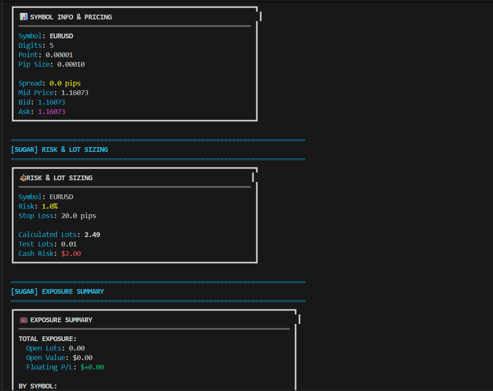

# main_sugar.py

## What this file is

Demonstration script showcasing **high-level sugar methods** that wrap low-level MT4 RPC calls.
It’s meant for quick onboarding: readable calls, sane defaults, and concise examples.

## Methods used here (with low‑level links)

- `ensure_connected(...)` → low‑level: _n/a (in-memory helper or connectivity check)_
- `ping(...)` → low‑level: _n/a (in-memory helper or connectivity check)_
- `ensure_symbol(...)` → low‑level: [symbols.md](../API_Reference/MT4Account.md)
- `digits(...)` → low‑level: [symbol_params_many.md](../API_Reference/MT4Account.md)
- `point(...)` → low‑level: [symbol_params_many.md](../API_Reference/MT4Account.md)
- `pip_size(...)` → low‑level: [tick_value_with_size.md](../API_Reference/MT4Account.md)
- `spread_pips(...)` → low‑level: [quote.md](../API_Reference/MT4Account.md)
- `mid_price(...)` → low‑level: [quote.md](../API_Reference/MT4Account.md)
- `last_quote(...)` → low‑level: [quote.md](../API_Reference/MT4Account.md)
- `calc_lot_by_risk(...)` → low‑level: [tick_value_with_size.md](../API_Reference/MT4Account.md)
- `calc_cash_risk(...)` → low‑level: [tick_value_with_size.md](../API_Reference/MT4Account.md)
- `buy_market(...)` → low‑level: [order_send.md](../API_Reference/MT4Account.md)
- `modify_sl_tp_by_pips(...)` → low‑level: [order_modify.md](../API_Reference/MT4Account.md)
- `close(...)` → low‑level: [order_close_delete.md](../API_Reference/MT4Account.md)
- `buy_limit(...)` → low‑level: [order_send.md](../API_Reference/MT4Account.md)
- `sell_market(...)` → low‑level: [order_send.md](../API_Reference/MT4Account.md)
- `modify_sl_tp_by_price(...)` → low‑level: [order_modify.md](../API_Reference/MT4Account.md)
- `close_all(...)` → low‑level: [order_close_delete.md](../API_Reference/MT4Account.md)

## Tips for working with this demo

- **Set defaults first.** Call `set_defaults(...)` for symbol/magic/pip settings to reduce noise.
- **Ensure connectivity.** Use `await ensure_connected()` and occasional `await ping()` in loops.
- **Normalize before send.** Normalize `price` and `lots`; convert pips↔price with helpers.
- **Use context overrides.** `with_defaults(...)` for temporary symbol/magic in a scoped block.
- **Log outcomes.** Print compact results (ticket, price, sl/tp) rather than raw objects.

## Output

You should see readable prints for each sugar call (quotes, placements, modifications, etc.).

 

